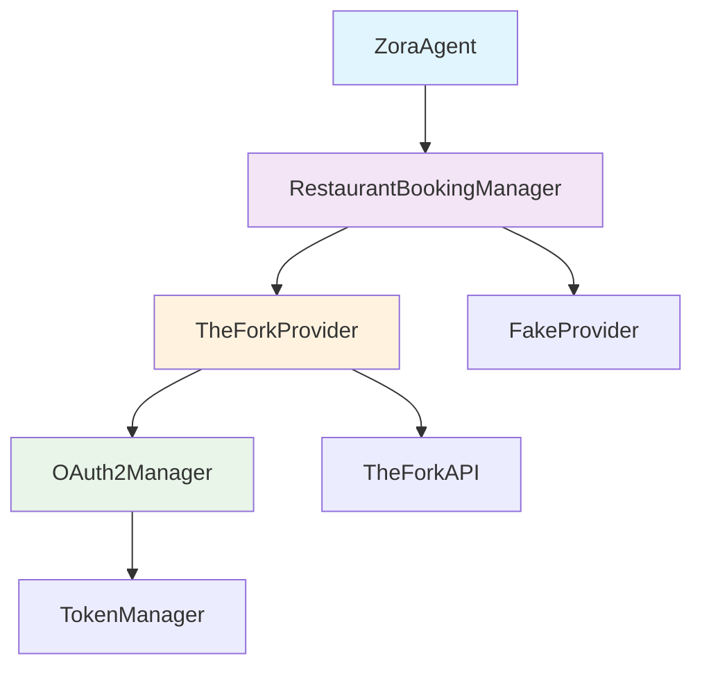
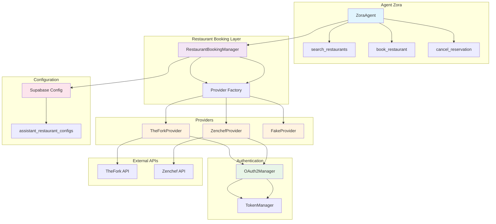

# Architecture d'Intégration API TheFork pour Zora

## Vue d'Ensemble

Cette proposition d'architecture détaille l'intégration de l'API TheFork dans l'assistant vocal Zora, en suivant les patterns existants du projet et en anticipant l'ajout futur d'autres plateformes de réservation.

## 1. Structure du Code Proposée

### 1.1 Nouveaux Modules Python

```
restaurant_booking/
├── __init__.py
├── protocols.py              # Interfaces communes
├── models.py                 # Modèles de données partagés
├── exceptions.py             # Exceptions spécifiques
├── providers/
│   ├── __init__.py
│   ├── base.py              # Classe abstraite de base
│   ├── thefork.py           # Implémentation TheFork
│   └── fake.py              # Implémentation de test
└── auth/
    ├── __init__.py
    ├── oauth2.py            # Gestionnaire OAuth2 générique
    └── token_manager.py     # Gestion du cycle de vie des tokens
```

### 1.2 Intégration dans l'Architecture Existante

Le nouveau module s'intègre naturellement dans l'architecture existante :

- **Même niveau que [`calendar_api.py`](calendar_api.py)** : module autonome au niveau racine
- **Pattern similaire** : utilise les mêmes conventions que [`CalComCalendar`](calendar_api.py:100)
- **Configuration cohérente** : suit le modèle de configuration par assistant via Supabase

## 2. Interaction avec l'Agent Principal

### 2.1 Modification de [`zora_agent.py`](zora_agent.py)

L'agent principal sera étendu avec de nouvelles fonctions-outils :

```python
# Nouvelles imports
from restaurant_booking import RestaurantBookingManager, BookingSlot, BookingError

class ZoraAgent(Agent):
    def __init__(self, *, timezone: str, custom_prompt: str = None) -> None:
        # ... code existant ...
        self._booking_slots_map: dict[str, BookingSlot] = {}

    @function_tool
    async def check_restaurant_availability(
        self,
        ctx: RunContext[Userdata],
        date: str,
        time: str,
        party_size: int = 2
    ) -> str:
        """Vérifier les disponibilités du restaurant pour une date/heure donnée"""
        # Implémentation pour LE restaurant configuré

    @function_tool
    async def book_restaurant_table(
        self,
        ctx: RunContext[Userdata],
        slot_id: str,
        user_name: str,
        user_phone: str,
        user_email: str,
        party_size: int
    ) -> str:
        """Réserver une table dans LE restaurant configuré"""
        # Implémentation de la réservation
```

### 2.2 Exemple d'Utilisation

```python
# Dans entrypoint()
restaurant_manager = None

if assistant_id:
    thefork_config = await get_assistant_thefork_config(assistant_id)
    if thefork_config and thefork_config.get('enabled', False):
        restaurant_manager = RestaurantBookingManager(
            provider='thefork',
            config=thefork_config,
            restaurant_id=thefork_config['restaurantId'],  # ID du restaurant spécifique
            timezone=timezone
        )

# Ajout à Userdata
session = AgentSession[Userdata](
    userdata=Userdata(
        cal=cal,
        restaurant_booking=restaurant_manager
    ),
    # ... reste de la configuration
)
```

## 3. Séparation des Responsabilités

### 3.1 Architecture en Couches



### 3.2 Responsabilités par Couche

- **ZoraAgent** : Logique conversationnelle et orchestration
- **RestaurantBookingManager** : Interface unifiée, gestion des erreurs métier
- **TheForkProvider** : Logique spécifique TheFork, mapping des données
- **OAuth2Manager** : Authentification OAuth2 générique
- **TokenManager** : Cycle de vie des tokens (cache, renouvellement)

## 4. Gestion de l'État et de la Configuration

### 4.1 Configuration Sécurisée

**Variables d'environnement (.env) :**
```bash
# Configuration TheFork (fallback global)
THEFORK_CLIENT_ID=your_client_id
THEFORK_CLIENT_SECRET=your_client_secret
THEFORK_BASE_URL=https://api.thefork.io

# Configuration par assistant (recommandée)
ASSISTANT_ID=your_assistant_uuid
```

**Configuration Supabase (par assistant) :**
```sql
-- Nouvelle table pour les configurations de réservation
CREATE TABLE assistant_restaurant_configs (
    id UUID PRIMARY KEY DEFAULT gen_random_uuid(),
    assistant_id UUID NOT NULL,
    provider VARCHAR(50) NOT NULL, -- 'thefork', 'zenchef', etc.
    restaurant_id VARCHAR(255) NOT NULL, -- ID du restaurant sur la plateforme
    enabled BOOLEAN DEFAULT false,
    config JSONB NOT NULL, -- credentials + config spécifique
    created_at TIMESTAMP WITH TIME ZONE DEFAULT NOW(),
    updated_at TIMESTAMP WITH TIME ZONE DEFAULT NOW()
);
```

### 4.2 Gestion du Cycle de Vie des Tokens

```python
class TokenManager:
    """Gestionnaire de tokens OAuth2 avec cache et renouvellement automatique"""
    
    def __init__(self, client_id: str, client_secret: str, base_url: str):
        self._client_id = client_id
        self._client_secret = client_secret
        self._base_url = base_url
        self._token_cache: dict = {}
        self._lock = asyncio.Lock()
    
    async def get_valid_token(self) -> str:
        """Retourne un token valide, le renouvelle si nécessaire"""
        async with self._lock:
            if self._is_token_expired():
                await self._refresh_token()
            return self._token_cache['access_token']
    
    async def _refresh_token(self) -> None:
        """Renouvelle le token OAuth2"""
        # Implémentation du flux Client Credentials
```

## 5. Évolutivité pour Autres Plateformes

### 5.1 Architecture Extensible

L'architecture proposée anticipe l'ajout de nouvelles plateformes :

```python
# protocols.py
class RestaurantProvider(Protocol):
    """Interface commune pour tous les fournisseurs de réservation"""
    
    async def initialize(self) -> None: ...
    
    async def get_restaurant_info(self) -> Restaurant: ...
    
    async def get_availabilities(
        self, date: datetime, party_size: int
    ) -> list[BookingSlot]: ...
    
    async def create_reservation(
        self, slot: BookingSlot, customer: CustomerInfo
    ) -> Reservation: ...
    
    async def cancel_reservation(self, reservation_id: str) -> None: ...
```

### 5.2 Factory Pattern pour les Providers

```python
class RestaurantBookingManager:
    """Manager principal qui orchestre les différents providers"""
    
    def __init__(self, provider_type: str, config: dict, restaurant_id: str, timezone: str):
        self.restaurant_id = restaurant_id
        self.timezone = timezone
        self.provider = self.create_provider(provider_type, config, restaurant_id)
    
    @staticmethod
    def create_provider(provider_type: str, config: dict, restaurant_id: str) -> RestaurantProvider:
        """Factory pour créer le bon provider"""
        providers = {
            'thefork': TheForkProvider,
            'zenchef': ZenchefProvider,  # Futur
            'fake': FakeRestaurantProvider
        }
        
        provider_class = providers.get(provider_type)
        if not provider_class:
            raise ValueError(f"Provider non supporté: {provider_type}")
        
        return provider_class(config, restaurant_id)
```

### 5.3 Ajout de Zenchef (Exemple Futur)

Pour ajouter Zenchef, il suffira de :

1. **Créer** [`providers/zenchef.py`](restaurant_booking/providers/zenchef.py)
2. **Implémenter** l'interface [`RestaurantProvider`](restaurant_booking/protocols.py)
3. **Ajouter** la configuration dans Supabase
4. **Enregistrer** dans la factory

**Aucune modification** de [`zora_agent.py`](zora_agent.py) ne sera nécessaire !

## 6. Classes et Modules Clés

### 6.1 Modèles de Données

```python
# models.py
@dataclass
class Restaurant:
    id: str
    name: str
    address: str
    cuisine_type: str
    rating: float
    price_range: str

@dataclass
class BookingSlot:
    id: str
    restaurant: Restaurant
    datetime: datetime.datetime
    duration_minutes: int
    party_size: int
    price: float | None = None
    
    @property
    def unique_hash(self) -> str:
        """Hash unique pour identification"""
        raw = f"{self.id}|{self.datetime.isoformat()}|{self.party_size}".encode()
        digest = hashlib.blake2s(raw, digest_size=5).digest()
        return f"RS_{base64.b32encode(digest).decode().rstrip('=').lower()}"

@dataclass
class CustomerInfo:
    name: str
    phone: str
    email: str
    special_requests: str | None = None

@dataclass
class Reservation:
    id: str
    restaurant: Restaurant
    customer: CustomerInfo
    datetime: datetime.datetime
    party_size: int
    status: str
    confirmation_code: str
```

### 6.2 Gestionnaire d'Exceptions

```python
# exceptions.py
class BookingError(Exception):
    """Exception de base pour les erreurs de réservation"""
    pass

class RestaurantNotAvailableError(BookingError):
    """Restaurant non disponible pour le créneau demandé"""
    pass

class AuthenticationError(BookingError):
    """Erreur d'authentification avec l'API"""
    pass

class QuotaExceededError(BookingError):
    """Quota API dépassé"""
    pass
```

### 6.3 Provider TheFork

```python
# providers/thefork.py
class TheForkProvider:
    """Implémentation spécifique pour l'API TheFork"""
    
    def __init__(self, config: dict):
        self.client_id = config['clientId']
        self.client_secret = config['clientSecret']
        self.base_url = config.get('baseUrl', 'https://api.thefork.io')
        self.token_manager = TokenManager(
            self.client_id, 
            self.client_secret, 
            self.base_url
        )
    
    async def search_restaurants(
        self, location: str, date: datetime, party_size: int
    ) -> list[Restaurant]:
        """Recherche de restaurants via l'API TheFork"""
        # Implémentation spécifique TheFork
    
    async def get_availabilities(
        self, restaurant_id: str, date: datetime, party_size: int
    ) -> list[BookingSlot]:
        """Récupération des créneaux disponibles"""
        # Utilise les endpoints TheFork :
        # - GET /v1/restaurants/{id}/availabilities
        # - GET /v1/restaurants/{id}/timeslots
        # - GET /v1/restaurants/{id}/partysizes
```

## 7. Diagramme d'Architecture Globale



## 8. Plan d'Implémentation Recommandé

### Phase 1 : Fondations
1. Créer la structure de modules
2. Implémenter les modèles de données
3. Créer l'interface `RestaurantProvider`
4. Développer `FakeRestaurantProvider` pour les tests

### Phase 2 : Authentification
1. Implémenter `OAuth2Manager`
2. Développer `TokenManager` avec cache
3. Tests d'authentification TheFork

### Phase 3 : Provider TheFork
1. Implémenter `TheForkProvider`
2. Mapper les endpoints API
3. Gestion des erreurs spécifiques

### Phase 4 : Intégration Agent
1. Étendre `ZoraAgent` avec les nouvelles fonctions
2. Modifier le prompt par défaut
3. Tests d'intégration complets

### Phase 5 : Configuration UI
1. Ajouter l'interface de configuration dans le frontend
2. Créer les fonctions Supabase Edge
3. Tests end-to-end

## 9. Avantages de cette Architecture

### 9.1 Maintenabilité
- **Séparation claire** des responsabilités
- **Code réutilisable** entre providers
- **Tests unitaires** facilités

### 9.2 Évolutivité
- **Ajout facile** de nouveaux providers
- **Configuration flexible** par assistant
- **API unifiée** pour l'agent

### 9.3 Robustesse
- **Gestion centralisée** des erreurs
- **Authentification sécurisée** avec renouvellement automatique
- **Fallback** vers provider de test

### 9.4 Cohérence
- **Patterns existants** respectés
- **Conventions de nommage** cohérentes
- **Structure similaire** à [`calendar_api.py`](calendar_api.py)

## 10. Considérations de Sécurité

- **Secrets jamais en dur** : utilisation exclusive des variables d'environnement
- **Tokens en mémoire** : pas de persistance sur disque
- **HTTPS obligatoire** : toutes les communications chiffrées
- **Validation des entrées** : sanitisation des données utilisateur
- **Rate limiting** : respect des quotas API

Cette architecture offre une base solide pour l'intégration TheFork tout en préparant l'avenir avec d'autres plateformes de réservation.