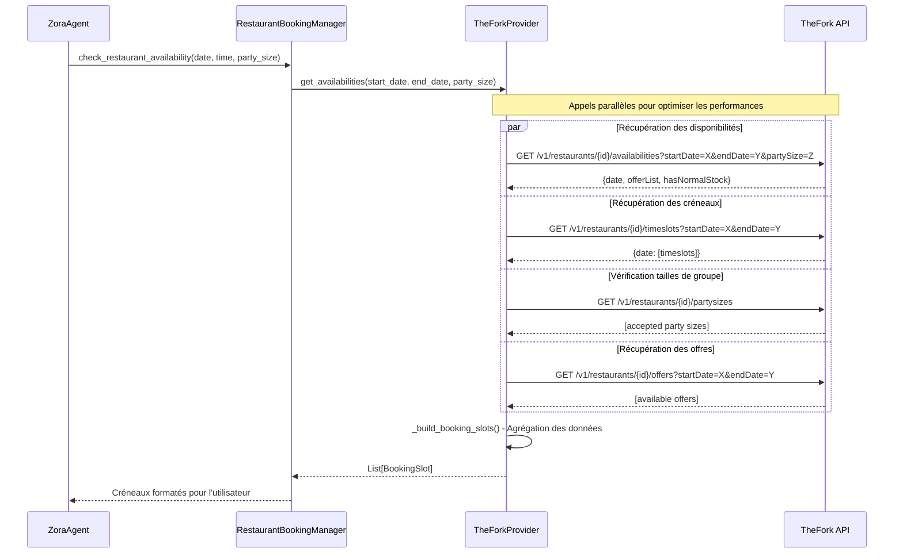

# Mapping Technique des Endpoints TheFork

## Vue d'Ensemble

Ce document détaille l'implémentation technique exacte des endpoints TheFork dans l'architecture proposée, basé sur la documentation officielle de l'API.

## Endpoints TheFork Utilisés

### 1. Recherche de Créneaux ("cherche un slot")

#### 1.1 GET `/v1/restaurants/{id}/availabilities`
**Documentation :** https://docs.thefork.io/B2B-API/API%20specifications/get-v-1-restaurants-id-availabilities

**Paramètres requis :**
- `id` (path) : UUID du restaurant
- `startDate` (query) : Date de début (format string)
- `endDate` (query) : Date de fin (format string) 
- `partySize` (query) : Nombre de personnes (number)

**Réponse :**
```json
{
  "date": "string",
  "offerList": ["string"],
  "hasNormalStock": boolean
}
```

#### 1.2 GET `/v1/restaurants/{id}/offers`
**Documentation :** https://docs.thefork.io/B2B-API/API%20specifications/get-v-1-restaurants-id-offers

**Usage :** Récupérer les offres spéciales disponibles pour le restaurant

#### 1.3 GET `/v1/restaurants/{id}/partysizes`
**Documentation :** https://docs.thefork.io/B2B-API/API%20specifications/get-v-1-restaurants-id-partysizes

**Usage :** Obtenir les tailles de groupe acceptées par le restaurant

#### 1.4 GET `/v1/restaurants/{id}/timeslots`
**Documentation :** https://docs.thefork.io/B2B-API/API%20specifications/get-v-1-restaurants-id-timeslots

**Usage :** Récupérer les créneaux horaires disponibles

### 2. Création de Réservation ("reserve")

#### 2.1 POST `/v1/restaurants/{id}/reservations`
**Documentation :** https://docs.thefork.io/B2B-API/API%20specifications/post-v-1-restaurants-id-reservations

**Usage :** Créer une nouvelle réservation

### 3. Gestion des Réservations

#### 3.1 GET `/v1/reservations/{id}`
**Documentation :** https://docs.thefork.io/B2B-API/API%20specifications/get-v-1-reservations-id

**Usage :** Consulter les détails d'une réservation

#### 3.2 PATCH `/v1/reservations/{id}`
**Documentation :** https://docs.thefork.io/B2B-API/API%20specifications/patch-v-1-reservations-id

**Usage :** Modifier une réservation existante

#### 3.3 PATCH `/v1/reservations/{id}/cancel`
**Documentation :** https://docs.thefork.io/B2B-API/API%20specifications/patch-v-1-reservations-id-cancel

**Usage :** Annuler une réservation

## Implémentation dans TheForkProvider

### Classe TheForkProvider - Méthodes Principales

```python
class TheForkProvider:
    def __init__(self, config: dict, restaurant_id: str):
        self.restaurant_id = restaurant_id  # ID du restaurant configuré
        self.client_id = config['clientId']
        self.client_secret = config['clientSecret']
        self.base_url = config.get('baseUrl', 'https://api.thefork.io/manager')
        self.token_manager = TokenManager(self.client_id, self.client_secret, self.base_url)

    async def get_availabilities(
        self, 
        start_date: datetime, 
        end_date: datetime, 
        party_size: int
    ) -> list[BookingSlot]:
        """
        Agrège les données de plusieurs endpoints pour construire les créneaux disponibles
        """
        # 1. Récupérer les disponibilités générales
        availabilities = await self._get_restaurant_availabilities(start_date, end_date, party_size)
        
        # 2. Récupérer les créneaux horaires
        timeslots = await self._get_restaurant_timeslots(start_date, end_date)
        
        # 3. Vérifier les tailles de groupe acceptées
        party_sizes = await self._get_restaurant_party_sizes()
        
        # 4. Récupérer les offres disponibles
        offers = await self._get_restaurant_offers(start_date, end_date)
        
        # 5. Agréger et mapper vers BookingSlot
        return self._build_booking_slots(availabilities, timeslots, party_sizes, offers, party_size)

    async def _get_restaurant_availabilities(
        self, 
        start_date: datetime, 
        end_date: datetime, 
        party_size: int
    ) -> dict:
        """GET /v1/restaurants/{id}/availabilities"""
        token = await self.token_manager.get_valid_token()
        
        params = {
            'startDate': start_date.strftime('%Y-%m-%d'),
            'endDate': end_date.strftime('%Y-%m-%d'),
            'partySize': party_size
        }
        
        headers = {
            'Authorization': f'Bearer {token}',
            'Accept': 'application/json'
        }
        
        url = f"{self.base_url}/v1/restaurants/{self.restaurant_id}/availabilities"
        
        async with self._http_session.get(url, params=params, headers=headers) as response:
            response.raise_for_status()
            return await response.json()

    async def _get_restaurant_timeslots(
        self, 
        start_date: datetime, 
        end_date: datetime
    ) -> dict:
        """GET /v1/restaurants/{id}/timeslots"""
        token = await self.token_manager.get_valid_token()
        
        params = {
            'startDate': start_date.strftime('%Y-%m-%d'),
            'endDate': end_date.strftime('%Y-%m-%d')
        }
        
        headers = {
            'Authorization': f'Bearer {token}',
            'Accept': 'application/json'
        }
        
        url = f"{self.base_url}/v1/restaurants/{self.restaurant_id}/timeslots"
        
        async with self._http_session.get(url, params=params, headers=headers) as response:
            response.raise_for_status()
            return await response.json()

    async def _get_restaurant_party_sizes(self) -> dict:
        """GET /v1/restaurants/{id}/partysizes"""
        token = await self.token_manager.get_valid_token()
        
        headers = {
            'Authorization': f'Bearer {token}',
            'Accept': 'application/json'
        }
        
        url = f"{self.base_url}/v1/restaurants/{self.restaurant_id}/partysizes"
        
        async with self._http_session.get(url, headers=headers) as response:
            response.raise_for_status()
            return await response.json()

    async def _get_restaurant_offers(
        self, 
        start_date: datetime, 
        end_date: datetime
    ) -> dict:
        """GET /v1/restaurants/{id}/offers"""
        token = await self.token_manager.get_valid_token()
        
        params = {
            'startDate': start_date.strftime('%Y-%m-%d'),
            'endDate': end_date.strftime('%Y-%m-%d')
        }
        
        headers = {
            'Authorization': f'Bearer {token}',
            'Accept': 'application/json'
        }
        
        url = f"{self.base_url}/v1/restaurants/{self.restaurant_id}/offers"
        
        async with self._http_session.get(url, params=params, headers=headers) as response:
            response.raise_for_status()
            return await response.json()

    def _build_booking_slots(
        self, 
        availabilities: dict, 
        timeslots: dict, 
        party_sizes: dict, 
        offers: dict, 
        requested_party_size: int
    ) -> list[BookingSlot]:
        """
        Agrège les données des différents endpoints pour construire les BookingSlot
        """
        slots = []
        
        # Logique d'agrégation basée sur la structure de réponse TheFork
        # Combine availabilities + timeslots + offers pour créer les créneaux finaux
        
        for availability in availabilities.get('data', []):
            date = availability.get('date')
            if availability.get('hasNormalStock', False):
                # Créer des slots pour cette date
                for timeslot in timeslots.get('data', {}).get(date, []):
                    slot = BookingSlot(
                        id=f"{self.restaurant_id}_{date}_{timeslot}",
                        restaurant_id=self.restaurant_id,
                        datetime=self._parse_datetime(date, timeslot),
                        duration_minutes=120,  # Durée standard
                        party_size=requested_party_size,
                        offers=availability.get('offerList', [])
                    )
                    slots.append(slot)
        
        return slots

    async def create_reservation(
        self, 
        slot: BookingSlot, 
        customer: CustomerInfo
    ) -> Reservation:
        """POST /v1/restaurants/{id}/reservations"""
        token = await self.token_manager.get_valid_token()
        
        payload = {
            'date': slot.datetime.strftime('%Y-%m-%d'),
            'time': slot.datetime.strftime('%H:%M'),
            'partySize': slot.party_size,
            'customer': {
                'name': customer.name,
                'email': customer.email,
                'phone': customer.phone
            },
            'specialRequests': customer.special_requests
        }
        
        headers = {
            'Authorization': f'Bearer {token}',
            'Content-Type': 'application/json',
            'Accept': 'application/json'
        }
        
        url = f"{self.base_url}/v1/restaurants/{self.restaurant_id}/reservations"
        
        async with self._http_session.post(url, json=payload, headers=headers) as response:
            response.raise_for_status()
            reservation_data = await response.json()
            
            return self._map_reservation_response(reservation_data)

    async def get_reservation_details(self, reservation_id: str) -> Reservation:
        """GET /v1/reservations/{id}"""
        token = await self.token_manager.get_valid_token()
        
        headers = {
            'Authorization': f'Bearer {token}',
            'Accept': 'application/json'
        }
        
        url = f"{self.base_url}/v1/reservations/{reservation_id}"
        
        async with self._http_session.get(url, headers=headers) as response:
            response.raise_for_status()
            reservation_data = await response.json()
            
            return self._map_reservation_response(reservation_data)

    async def update_reservation(
        self, 
        reservation_id: str, 
        updates: dict
    ) -> Reservation:
        """PATCH /v1/reservations/{id}"""
        token = await self.token_manager.get_valid_token()
        
        headers = {
            'Authorization': f'Bearer {token}',
            'Content-Type': 'application/json',
            'Accept': 'application/json'
        }
        
        url = f"{self.base_url}/v1/reservations/{reservation_id}"
        
        async with self._http_session.patch(url, json=updates, headers=headers) as response:
            response.raise_for_status()
            reservation_data = await response.json()
            
            return self._map_reservation_response(reservation_data)

    async def cancel_reservation(self, reservation_id: str) -> None:
        """PATCH /v1/reservations/{id}/cancel"""
        token = await self.token_manager.get_valid_token()
        
        headers = {
            'Authorization': f'Bearer {token}',
            'Accept': 'application/json'
        }
        
        url = f"{self.base_url}/v1/reservations/{reservation_id}/cancel"
        
        async with self._http_session.patch(url, headers=headers) as response:
            response.raise_for_status()
```

## Flux d'Appels API pour "Chercher un Slot"



## Gestion des Erreurs API

```python
class TheForkAPIError(Exception):
    """Erreur spécifique à l'API TheFork"""
    pass

class TheForkProvider:
    async def _handle_api_response(self, response):
        """Gestion centralisée des erreurs API TheFork"""
        if response.status == 401:
            # Token expiré, forcer le renouvellement
            await self.token_manager.invalidate_token()
            raise AuthenticationError("Token TheFork expiré")
        elif response.status == 404:
            raise RestaurantNotFoundError(f"Restaurant {self.restaurant_id} non trouvé")
        elif response.status == 409:
            raise SlotUnavailableError("Créneau non disponible")
        elif response.status >= 400:
            error_data = await response.json()
            raise TheForkAPIError(f"Erreur API TheFork: {error_data}")
```

## Configuration Requise

```python
# Configuration minimale pour TheFork
thefork_config = {
    'clientId': 'your_client_id',
    'clientSecret': 'your_client_secret',
    'baseUrl': 'https://api.thefork.io/manager',  # URL de base
    'restaurantId': 'restaurant_uuid_from_thefork'  # ID du restaurant sur TheFork
}
```

Cette implémentation respecte exactement les spécifications de l'API TheFork que vous avez mentionnées et assure une intégration technique précise.