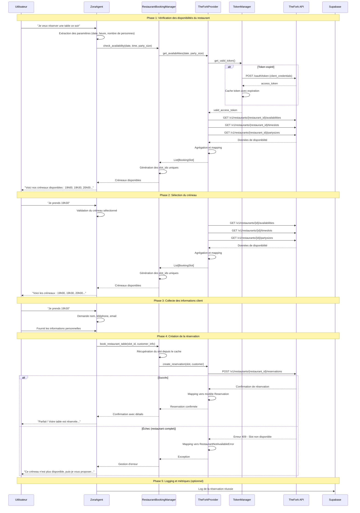
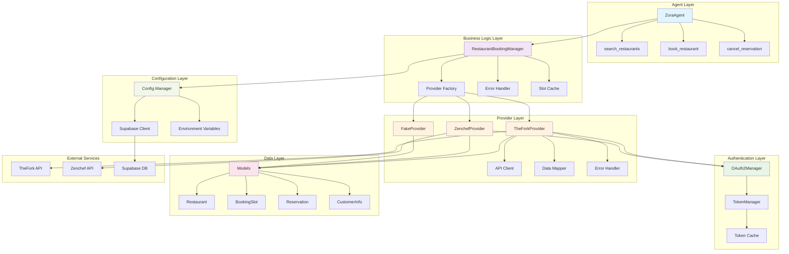
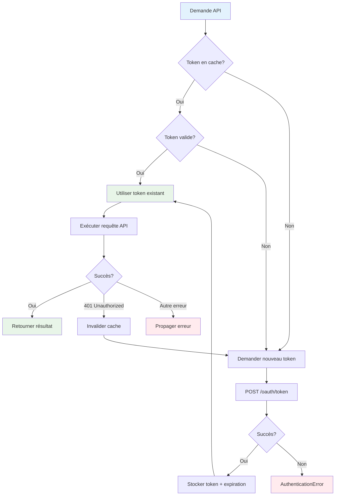
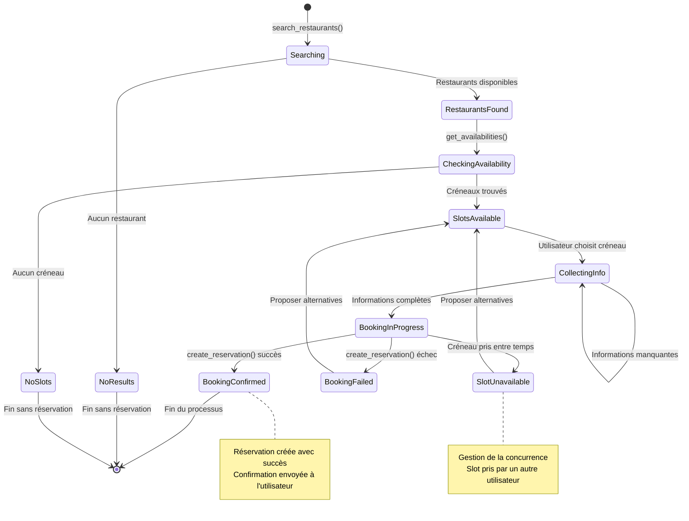
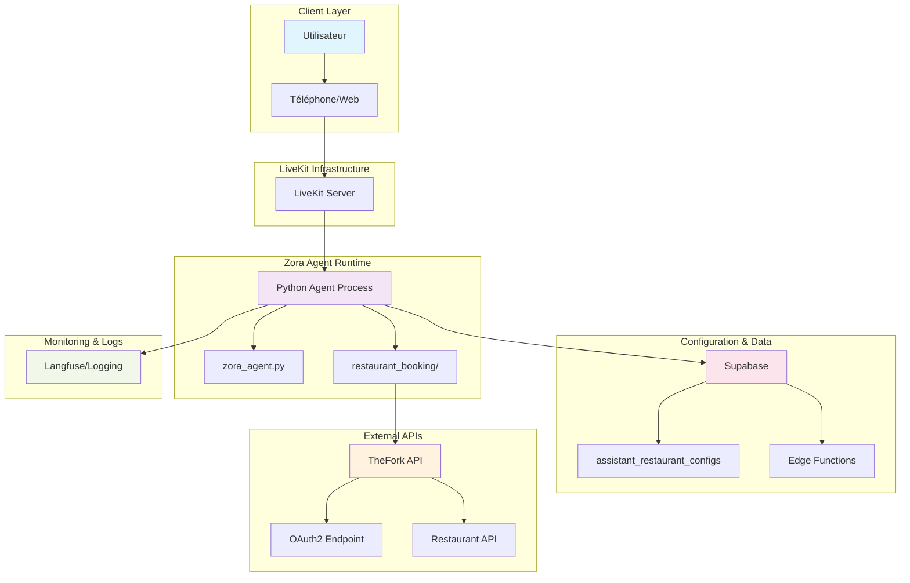
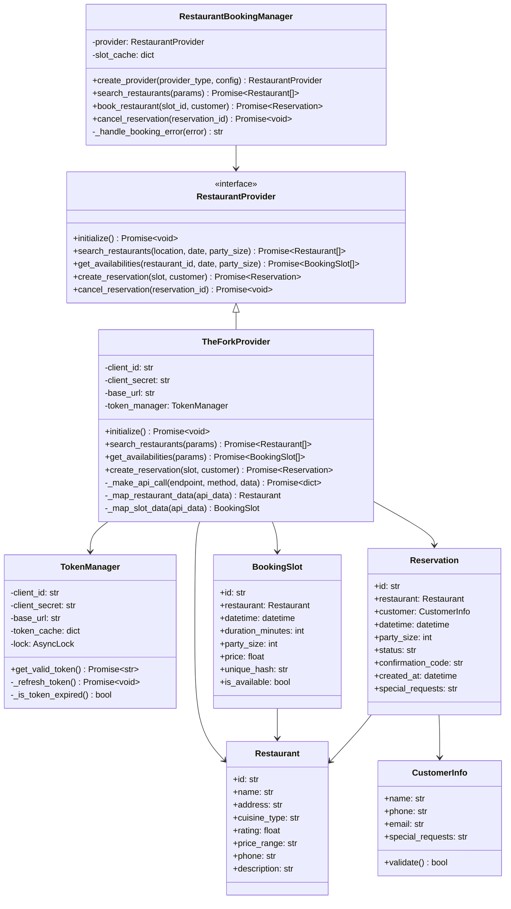

# Diagrammes d'Architecture - Intégration TheFork

## 1. Diagramme de Séquence : Réservation de Restaurant

## 2. Diagramme de Composants : Architecture Modulaire

## 3. Diagramme de Flux : Gestion des Tokens OAuth2

## 4. Diagramme d'États : Cycle de Vie d'une Réservation

## 5. Diagramme de Déploiement : Architecture Système

## 6. Diagramme de Classes : Modèles de Données

Ces diagrammes illustrent l'architecture complète de l'intégration TheFork, depuis les interactions utilisateur jusqu'aux détails techniques de l'implémentation.